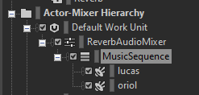
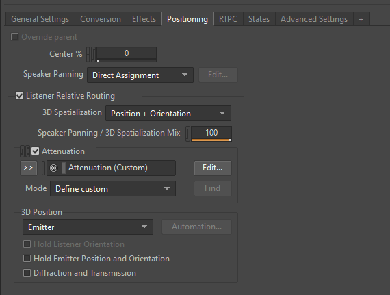
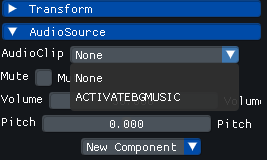
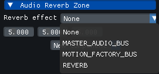

# Ragnar Engine

Ragnar Engine is a Video Game Engine created by Lucas Pérez and Oriol Bernal. Two students from the university Universitat Politècnica de Catalunya (CITM).

The purpose of this project is to create a friendly-user, well optimized Game Engine for the subject "VideoGame Engines" from the 3rd year. The short term plan is to implement the basic features of a Game Engine, such as loading models, working in a 3D environment, etc...
For the long term, we would love to create a game with this Video Game Engine

## Team Members

* Lucas Pérez: Lucas mainly focused in the Resource Manager part of the engine, creating all the needed functionalities aswell as a good layout for better user experience. He also spent a lot of time making sure that the game engine 
was well optimized. 

   * [Github page](https://github.com/LucasPG14)
   * [LinkedIn](https://www.linkedin.com/in/lucas-p%C3%A9rez-garc%C3%ADa-4473631b9/)

* Oriol Bernal: Oriol mainly focused on the camera part of the engine, creating the frustum camera. He also did the time management so the game engine could have a timer for the game and the engine itself.
Finally, Oriol did the mousepicking so the gameobjects could be selected.

   * [Github page](https://github.com/UriKurae)
   * [LinkedIn](https://www.linkedin.com/in/oriol-bernal-martinez-54b093176/)

* Overall: The game engine was done by both programmers day-by-day working together in Discord, so everything worked correctly.

## Core subsystem (Audio)

We had to implement the Audio core subsystem with WWise. The main objective was to be able to play sounds/musics, etc... in our game engine, aswell as creating some reverb zone and some
audio settings, like pitch, volume... Also, another objective from this subsystem was to properly learn how WWise API works.

## Audio in depth

The audio subsystem had three main goals: 

#### - Two background music that could blend between each other in a loop:
We did this by basically controlling both the music options in WWise. WWise has many functionalities, including one that lets you create playlist for your sounds, so it's as easy as creating a sequence and telling Wwise how to play them and in which order.
When you do this, as soon as you play the music in the engine, the functions from Wwise have the information on how to play them and in which order.

#### - Spatial audio:
The main goal of this objective was to be able to listen the sound effects/music depending on the listener´s position. This is also done easily by the WWise API, but you have to do some code aswell.
In the WWise API you have to go to the "Positioning" tab and check the 3D Spatialization aswell as the Attenuation. With this options, WWise knows how to play the music depending on the listener´s position.
But this is not it, you have to go to the source code and implement a position and orientation for the listener, so WWise knows how to calculate the distance. We did this with a simple function that asks for 2 parameters: the UUID from the gameobject and it´s position.
Once you call the function correctly, WWise will register the gameobject's position and will know how to treat it.

#### - Special effect (Reverb):
The assignment asked for a tunnel effect in some area of the game. This was very difficult because there's not a lot of information on the subject. To create this effect, we had to go to the WWise API and create two different
busses, one for the normal audio, and another audio bus that contains an effect called "WiseRoomReverb" which simulates a tunnel sound with echo. The trick is that you need to swap the bus via code depending on the listener's current position. 
For this, we created a class called AudioReverbZone which creates an AABB simulating a collider zone, when the listener enters this zone, we call our audio singleton to use a function which is called
CheckReverbGameObject(). This function loops between all reverb zones to check if the listener is inside any of the colliders from the reverb zones. If the listener is inside, we swap the busses from the audio to the one with the reverb effect.

#### - Extra Functionalities:

We added some extra functionalities so it's not a pain to use the audio, this functionalities include:
* Sound options: Volume, mute and pitch. This options control the audio so you don't have to do it via code, volume ranges from 0 to 100. Pitch ranges from -2400 to 2400 and mute just mutes the volume (Mute option does not pause the music!).
* Play On Awake functionality: Similar to Unity, if you check this box, it will play as soon as you start your game. It is also affected by the pause and stop from the game timer.
* Debug options (Play, Pause, Resume, Stop): You can check the audio by playing it, pausing, resuming or stoping it. The buttons are easily located in the audio source component.
* Auto-Load: To avoid having to code each time you import something into the audio, we created some functionalities to read files, this adds an extra step in the Wwise API but saves a lot of time and possible grammar mistakes. To
benefit from this functionalities, you only need to do 1 extra step in the WWise API, that is to check the "Generate header files", this, when generating the sound banks, will generate a header file that we use to 
read all the information, so this needs to be imported to the engine assets folder. This way, also, when you want to put an audio source or a special effect into the reverb zone, the engine will show you a dropdown menu
with all the sounds or effects available.

## Video demonstration

This video demonstrates how the Audio System works, and it's utilities.

<iframe width="1024" height="720" src="https://www.youtube.com/embed/qJ91oxEbzHY" frameborder="0" allow="autoplay; encrypted-media" allowfullscreen></iframe>

## License

MIT License

Copyright (c) 2021 Oriol Bernal Martinez & Lucas Perez Garcia

Permission is hereby granted, free of charge, to any person obtaining a copy
of this software and associated documentation files (the "Software"), to deal
in the Software without restriction, including without limitation the rights
to use, copy, modify, merge, publish, distribute, sublicense, and/or sell
copies of the Software, and to permit persons to whom the Software is
furnished to do so, subject to the following conditions:

The above copyright notice and this permission notice shall be included in all
copies or substantial portions of the Software.

THE SOFTWARE IS PROVIDED "AS IS", WITHOUT WARRANTY OF ANY KIND, EXPRESS OR
IMPLIED, INCLUDING BUT NOT LIMITED TO THE WARRANTIES OF MERCHANTABILITY,
FITNESS FOR A PARTICULAR PURPOSE AND NONINFRINGEMENT. IN NO EVENT SHALL THE
AUTHORS OR COPYRIGHT HOLDERS BE LIABLE FOR ANY CLAIM, DAMAGES OR OTHER
LIABILITY, WHETHER IN AN ACTION OF CONTRACT, TORT OR OTHERWISE, ARISING FROM,
OUT OF OR IN CONNECTION WITH THE SOFTWARE OR THE USE OR OTHER DEALINGS IN THE
SOFTWARE.
